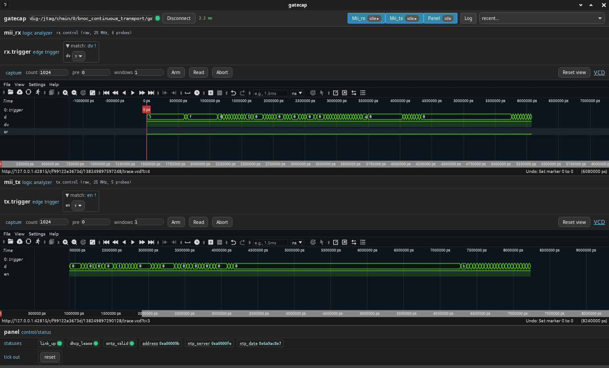

==================
SNTP clock example
==================

This project is showcase of the AXI4-Stream internet stack on the Arty
A7-35: plug the board on any DHCP-served network and watch the current
time appear.  The board acquires a lease over DHCP, learns the NTP
server from lease option 42, polls it over SNTP, and shows the result
on a Pmod OLEDrgb (SSD1331, 96x64) plugged on JA as a 16x8 text
screen::

  NSL SNTP CLOCK
  LINK up  DHCP ok
  IP ADDRESS
  010.000.000.155
  NTP SERVER
  010.000.000.254
  2026-09-04   UTC
  07:54:14 SNTP ok

Status rows turn green when good and red otherwise; the address
octets are zero padded to keep the layout fixed.  Date and time are
UTC, computed from the Unix seconds by ``nsl_time.calendar``; before
synchronization the screen shows the epoch and "SNTP -".

LEDs, left to right (LD4..LD7): heartbeat (~0.75 Hz), ethernet link
up, DHCP lease held, SNTP synchronized.  BTN0 is reset.

Architecture
============

::

  MII PHY (DP83848, addr 1, MII mode, 25 MHz ref from PLL)
    |            mdio: smi_master_line_driver
    |
  mii_axi_driver_resync              (nsl_mii, axi4_flit_cfg streams)
    |
    | rx: axi4_stream_fifo_clean     (drops errored frames, 2 KB)
    | tx: axi4_stream_prefill_buffer (64 beats, gapless line feed)
    |
  stream_ipv4_host                   (W=1, dhcp_c, hostname "arty")
    |
    | UDP port 123 pipe (byte-wide: no resizers needed at W=1)
    |
  stream_sntp_client                 (server from dhcp_ntp_server_o)
    |
    | time_o(63:32) - unix offset
    |
  screen_text (calendar_from_seconds, to_decimal_string, 16x8 cells)
    | terminal text buffer write port
  terminal_text_buffer (nsl_dvi, 6x8 font) -> pmod_oled_rgb_driver on JA

  link_monitor_smi (PHY_DP83xxx) -> smi_framed_transactor -> MDIO

  observer_core (gatecap rack over the chip TAP, description.yaml)
    | mii: logic analyzer on the raw MII rx and tx nibbles
    | panel: link, lease, address, NTP server, SNTP state, Unix seconds, reset

Everything above the MII driver lives in ``src/func/func_main.vhd``
(core 100 MHz domain, no vendor primitives); clocking, PHY driver,
glue fifos, MDIO line driver, LEDs, the display chain and the
observer live in ``src/boundary/fpga_io.vhd``, modeled on the
neighbouring ``inet`` (bnoc) example; the screen text generator is
``src/func/screen_text.vhd``.

Observing
=========

``description.yaml`` describes a gatecap rack that the build generates
and that shares the programming cable.  With the Digilent cable it is
reached at::

  dig-/jtag/chain/0/bnoc_continuous_transport/gatecap

The ``panel`` instrument mirrors the stack state; ``status.py`` dumps
it once::

  acrobe run status.py

The ``mii`` instrument samples the MII wires in their own clock
domains, 1024 samples per direction, triggering on the data valid and
transmit enable edges.  Capturing the first frame the PHY delivers,
and the first the stack sends::

  acrobe gatecap -r dig-/jtag/chain/0/bnoc_continuous_transport/gatecap \
    capture mii.rx.control --trigger dv=rising --count 1024 --pretrigger 8 \
    --output rx.vcd
  acrobe gatecap -r dig-/jtag/chain/0/bnoc_continuous_transport/gatecap \
    capture mii.tx.control --trigger en=rising --count 1024 --pretrigger 8 \
    --output tx.vcd

``acrobe gatecap -r <path> gui`` offers the same interactively.

Status
======

Synthesized with Vivado 2022.2 for the XC7A35T: timing met on the
100 MHz core clock, the two 25 MHz MII clocks and their crossings,
about 75 % of the LUTs used.  Programmed over JTAG with::

  acrobe chip -r dig-/jtag/chain/0 program --run sntp_clock.bit

The observer rack enumerates over the same cable and the panel reads
back.  Before any cable is plugged, a transmit capture on the MII
shows the DHCP discover leaving the PHY well formed: preamble and
SFD, valid FCS and IP header checksum, hostname and parameter request
list carrying option 42.

Plugged on a network served by isc-dhcp-server with
``option ntp-servers`` and an ntpsec server on the same host, the
board acquires its lease within a few seconds of link up, answers
ping, learns the NTP server from the lease and reports a valid SNTP
time matching the host clock, all visible on the panel.

Known integration points to watch
=================================

* The UDP checksum validator folds the local address as
  pseudo-header destination.  DHCP acquisition traverses it thanks
  to 0.0.0.0 and 255.255.255.255 folding identically in one's
  complement; this is by design (see the stream_dhcp package
  comment), not an accident to "fix" here.

* The demo needs a DHCP server handing out option 42.  dnsmasq:
  ``dhcp-option=option:ntp-server,<addr>``.  The SNTP client only
  polls once the lease carries a non-zero NTP server; off-subnet
  servers resolve through the lease gateway (ARP gateway diversion).

* Timing should be comfortable: the stack closed 156.25 MHz at W=4
  on this very part; this design runs W=1 at 100 MHz.

Display output
==============

The panel's ``ntp_date`` field and the screen both derive from the
same Unix seconds; ``status.py`` renders that field as a UTC date so
the two can be compared.
